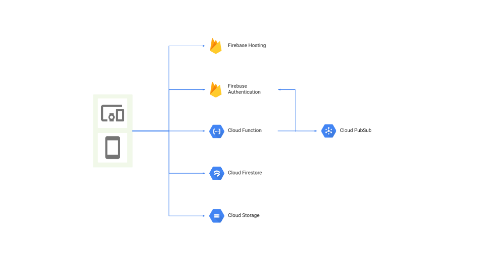

<!--
_backgroundColor: #1fe7cb;
_backgroundImage: url(../cover-logo.png);
_backgroundSize: 70% auto;
_backgroundPosition: bottom 40px right 30px;
-->

# Shopify アプリ開発事例 

2020/08/03
Shopify Partner Boot Camp in Japan #2

---

<!--
backgroundColor: #d5fbf5
backgroundImage: url(../logo.png);
backgroundSize: 15% auto;
backgroundPosition: bottom 50px right 40px;
-->

## 概要

- 自己紹介
- 技術スタックと開発方針
- Shopify アプリ開発事例
- App Archa の紹介

---

## 自己紹介

- 齊藤 正浩
  - ID: camelmasa
- Huckleberry, Inc. のプログラマー
  - Shopify アプリの開発をリード
- フリーランスで開発支援
- EC, 決済システムの開発経験あり
  - OSS Solidus/Spree の開発
  - (前職にて) KOMOJU の開発
    - Shopify に日本独自の決済方法の提供で連携

---

## 技術スタックと開発方針

- インフラ構成
- 採用している言語・ライブラリ
- 開発体制

---

### インフラ構成

- Firebase + GCP
  - Firebase Hosting 
  - Firebase Authentication
  - Firestore
  - Cloud Functions
  - Cloud Storage
  - Cloud PubSub

---

### インフラ構成(図)

---

### 採用している言語・ライブラリ

- TypeScript
- React
- Polaris, App Bridge

---

### 開発体制 (1)

- Firebase, TypeScript, React で構成
  - 生産性の最大化
    - フロントエンド、サーバーサイド、ネイティブアプリの開発に対応が可能 (iOS, Android, デスクトップ)
    - 型を利用してメンテナンスコストを低減
  - インフラコストを抑えたい
    - サーバーレスを利用してリソースを効率的に利用

---

### 開発体制 (2)

- Shopify が提供している shopify-app-node npm は利用しない
  - そもそもサーバーレスに対応していない設計のため
- GitHub Actions で CI
- Slack を使った ChatOps でデプロイ

---

## Shopify アプリ開発事例

- 送料無料バーアプリ
- 在庫アラートアプリ
- アフィリエイト連携アプリ
- 納品書アプリ (カスタムアプリ)
- その他ノウハウ

---

### 送料無料バーアプリ (1)

"送料無料"のバーを表示することができるアプリ。カート内との差額によって送料無料までに必要な価格が自動で表示される。

---

### 送料無料バーアプリ (2)

---

### 送料無料バーアプリ (3)

---

### 送料無料バーアプリ (4)

- 利用している GraphQL
  - shop
    - email の取得
  - scriptTagCreate
    - ストアのトップにバーを表示

---

### 送料無料バーアプリ (5)

- 苦労した点
  - 初めて作成したアプリなので、アプリの新規作成から審査完了までの流れがわからなかった
    - 単純に知識・経験不足
  - アンインストール時の作法がわからなかった
    - 再インストール時に過去のデータが重複してエラーになってしまう問題があり、アンインストール時にストアに関連するデータを削除する必要があった

---

### 在庫アラートアプリ (1)

商品の在庫が設定した閾値以下になった際に通知するアプリ。

---

### 在庫アラートアプリ (2)

---

### 在庫アラートアプリ (3)

- 利用している GraphQL
  - shop
    - email の取得
  - appSubscriptionCreate
    - 月額課金の作成

---

### 在庫アラートアプリ (4)

- 苦労した点
  - 課金周りの実装
    - scriptTagCreate API 同様アンインストールでプランが削除される挙動は想定外だった。

---

### アフィリエイト連携アプリ (1)

(現在審査中)
アフィリエイトのコンバージョンタグを自動で発行・設定するアプリ。アプリ内で成果の確認も可能。
現在は Valuecommerce と連携。

---

### アフィリエイト連携アプリ (2)

---

### アフィリエイト連携アプリ (3)

---

### アフィリエイト連携アプリ (4)

---

### アフィリエイト連携アプリ (5)

- 利用している GraphQL
  - shop
    - email, ストアのドメインを取得
      - 最近は アフィリエイト連携に DNS の設定が必須のため
  - scriptTagCreate
    - 決済完了画面にコンバージョンタグを追加

---

### アフィリエイト連携アプリ (6)

- 苦労した点
  - 想定以上に審査に時間がかかっている (現在も継続中)
    - 最初のレビューのタイミングで2週間必要とお知らせがあった
      - 単純に混み合っていた？
    - 1度のレビュー時に全ての画面が確認できないアプリの場合、アプリを操作している動画を求められる
      - なので最初の申請時に併せて動画も申請した方がやりとりの回数が減る

---

### 納品書アプリ (1)

納品書を発行するアプリ。
細かな要素の変更が可能となっており、数分で数千件の納品書を発行することが出来る。
現在のところはカスタムアプリとして開発・運用。

---

### 納品書アプリ (2)

- 利用している GraphQL
  - shop
    - email, ストア住所の取得
  - bulkOperation
    - 納品書の作成に必要な注文に紐づいた情報を取得

---

### 納品書アプリ (3)

- 苦労した点
  - 扱うデータ量が多く、同期的な API のみの利用だと制限に達するため、非同期で取得可能な bulkOperation API を使わざるをえなかった
    - そのため、取得完了まで時間を必要とするので、UI を工夫する必要がある
      - 具体的には、bulkOperation のステータスを表示するなどで対応

<!-- ---
   
### 佐川急便連携アプリ (1)

注文情報から佐川急便のフォーマットを生成するアプリ。

---

### 佐川急便連携アプリ (1)

- 利用している GraphQL
  - order, shop, scriptTagCreate
- 苦労した点
  - 特になし
-->

---

### その他ノウハウ (1)

- 全般
  - Shopify アプリの仕様や作法でわからない事があったらコミュニティ内を調べたり聞く
    - 海外コミュニティはユーザーが多いため解決事例が多い
    - 日本のコミュニティでは岡村さんが丁寧に教えてくれる

---

### その他ノウハウ (2)

- ログインの実装
  - Shopify API authentication には access modes というものがあり、Offline か Online を選べる
  - ユーザー単位でのログインが必要なアプリは稀なので Offline のみで問題ないと判断
    - サーバーサイドで Shop ID をキーとして Firebase Authentication のカスタムトークンを発行し、フロントエンドでログイン

---

### その他ノウハウ (3)

- 審査について
  - 提出内容にスクリーンショットを利用する場合 Shopify のロゴを入れてはいけない
    - 割と忘れがち
  - テスト方法についての説明は日本語と同時に英語も含めて申請したほうが、返信が速い(気がする)

---

### その他ノウハウ (4)

- 利用している npm
  - react-number-format
    - Polaris の table で数字周り表示したい時便利
    - カンマ表記、通貨の表示に対応 (e,g, ¥1,000)
  - graphql-code-generator
    - Shopify GraphQL に IntrospectionQuery を発行した結果から型情報を含んだ GraphQL のコードを自動作成

---

### その他ノウハウ (5)

---

### その他ノウハウ (6)

- 利用している npm
  - @huckleberry-inc/shopify-app-history
    - App Bridge の履歴管理と React Router の履歴管理を同時に行うライブラリ
    - React Hook として利用可能
  - @huckleberry-inc/shopify-app-locales
    - GraphQL で取得した内容で英語になっている箇所を翻訳
    - 都道府県の他に注文、決済、フルフィルメントのステータスの翻訳に対応

---

### その他ノウハウ (7)

- 共通で利用しているツール・プロジェクト
  - @huckleberry-inc/shopify-app-endpoints
    - GDPR 用のエンドポイントは全てのアプリで共通化しアプリ毎に実装するコストを抑える
      - 環境変数にアプリのシークレットキーを追加すれば対応完了
  - @huckleberry-inc/shopify-app-bridge-sampler
    - Shopify の公式ドキュメントでは App Bridge の UI を確認することができない
    - App Bridge の動作や UI を確認できる Shopify App

<!--

### 解決出来ていない問題

- ngrok に依存している状態を改善したい
  - 開発が止まる
    - 稀に ngrok がレスポンスを返さない
  - app-bridge-host npm を使えば、アプリが動作するホストをエミュレートすることができるが、一部の App Bridge がサーバーサイドで動作するため、Shopify が mock なりを用意してくれないと完全にエミュレートできない
  - Shopify 開発側にはこの辺改善して欲しいと思っている
  - もし解決されている方いたら話聞きたいです:cry:

---

--> 

---

## App Archa の紹介

EC のブランディング事業をおこなっている FRACTA, Inc. さんとの共同事業。
Shopify が提唱している Polaris デザインのルールに準拠した Shopify アプリの開発・提供を行なっています。

日本向けの日本らしいアプリを作っていきます。

アプリの開発のご相談お待ちしています！

---

## Shopify アプリ開発者募集中

- App Archa で提供・運営予定の Shopify 公開アプリの開発
- Firebase, TypeScript, React の利用
- フルリモート
- フリーランス
  - 副業としても ok
- EC 経験者歓迎 :smile: